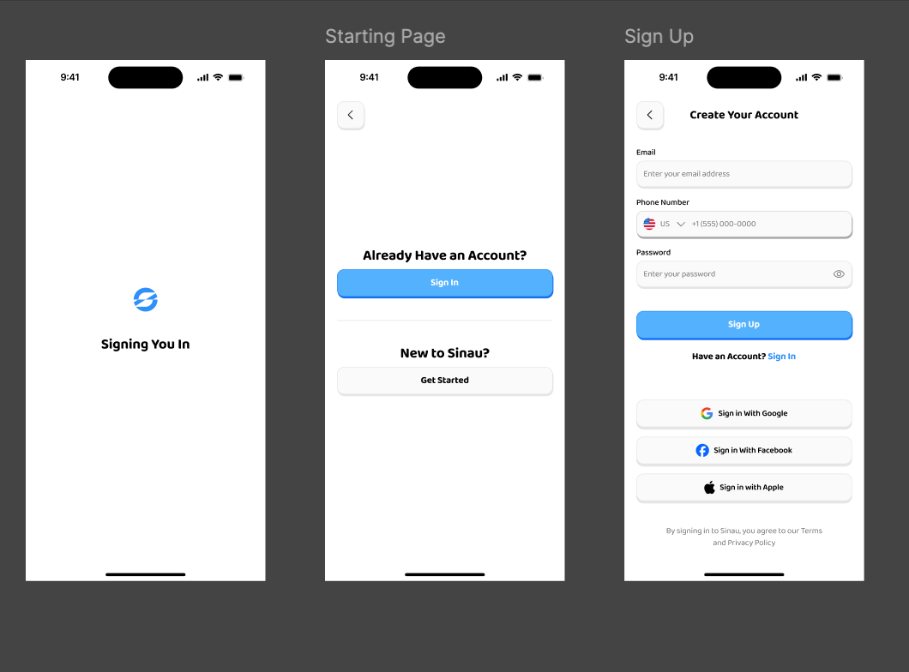
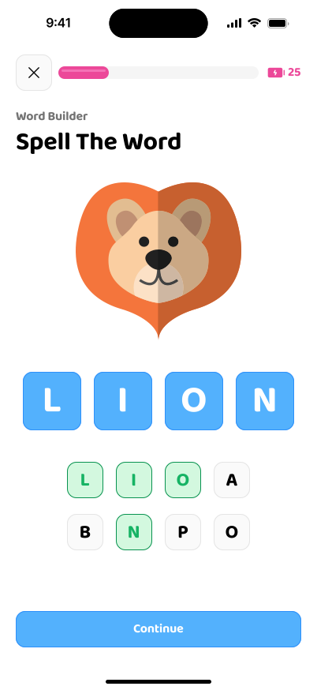
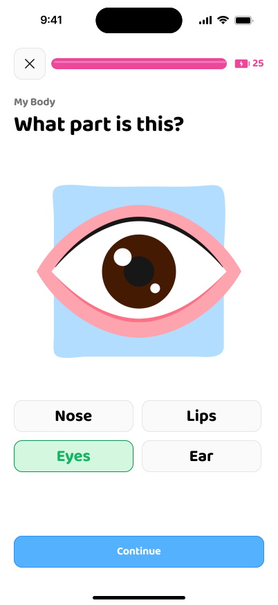
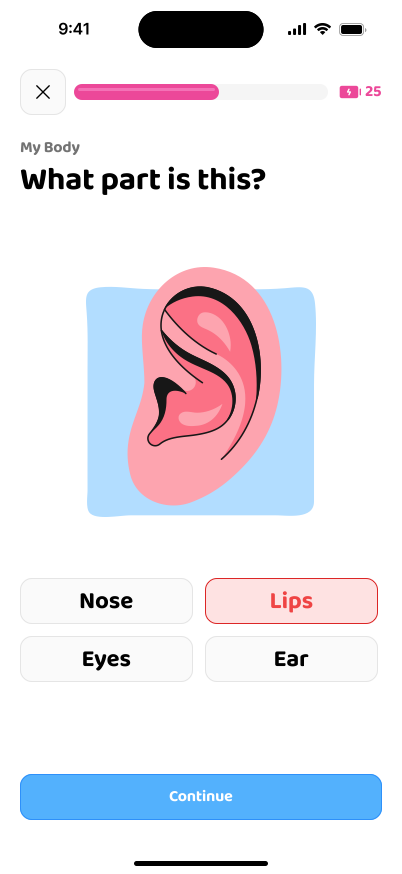

# Nifunze App

A fun and interactive kids learning application built with Flutter. Nifunze provides engaging educational paths in various subjects to help children learn effectively.

## Features

- **Authentication:** Secure Sign In and Sign Up (including Social Auth).
- **Interactive Learning Paths:**
  - **Math:** Counting, Addition, Subtraction, Time, Money, Fill the Gap.
  - **Alphabet:** Letter of the Day, Trace the Letter, Alphabet Map, Find the Vowel, Listen & Match.
  - **Animals:** Animal Kingdom, Match It, Find the Sounds, Where do I Live, Guess the Animal.
  - **Knowledge:** My Body, Opposites, World Builder.
- **Dashboard & Engagement:**
  - Day Streaks and Energy tracking.
  - Leaderboards to compete with friends.
  - Rewards and Chests to keep kids motivated.
- **Social Features:**
  - User Profiles and Settings.
  - Follow Friends via QR codes or contacts.
  - View Friends' progress and rewards.

## Screenshots

  
  

  
  

## Getting Started

This project is built using Flutter and follows a Clean Architecture approach with BLoC for state management.

### Prerequisites

- Flutter SDK (v3.7.0 or higher)
- Dart SDK
- iOS Simulator or Android Emulator

### Installation

1. Clone this repository.
2. Run `flutter pub get` to install dependencies.
3. Run `flutter run` to launch the app on your connected device or emulator.

## Tech Stack

- **Framework:** [Flutter](https://flutter.dev/)
- **State Management:** BLoC
- **Navigation:** go_router
- **Backend:** Firebase (Auth, Firestore) / Supabase Integration
- **Architecture:** Clean Architecture
